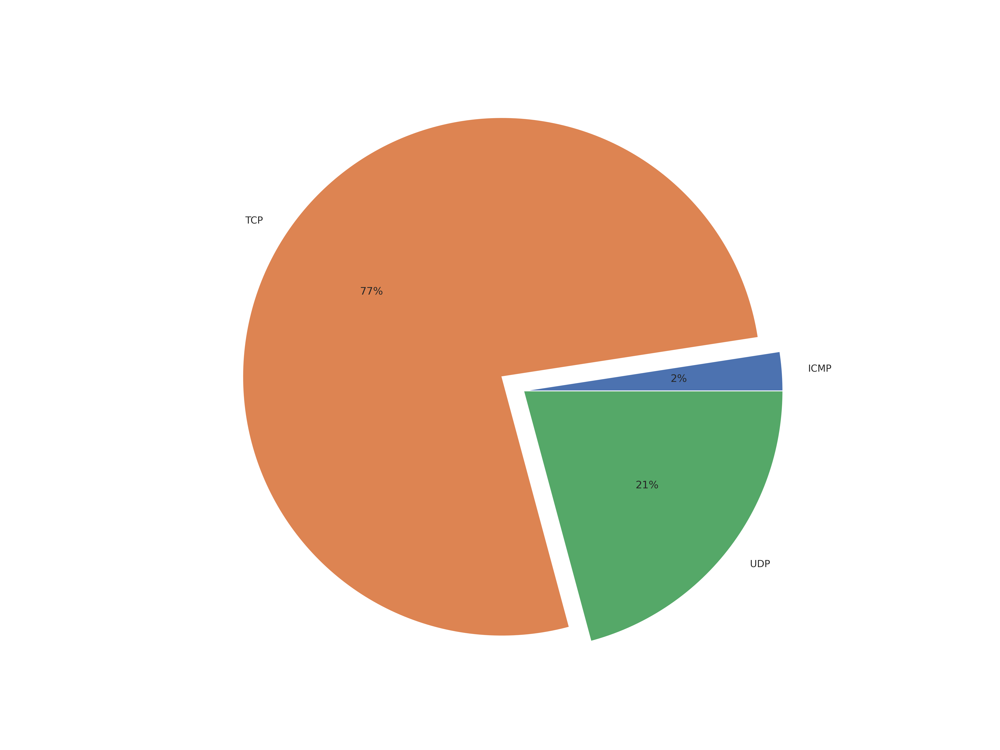
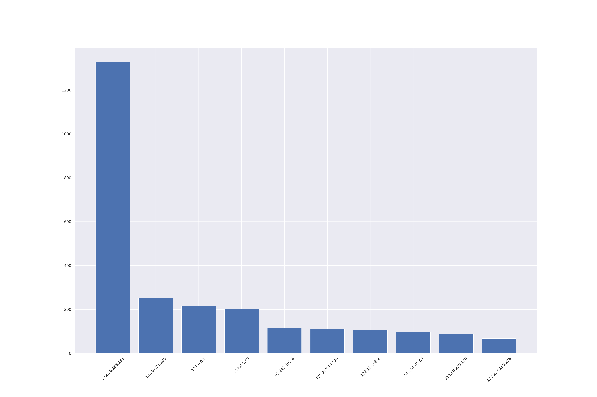
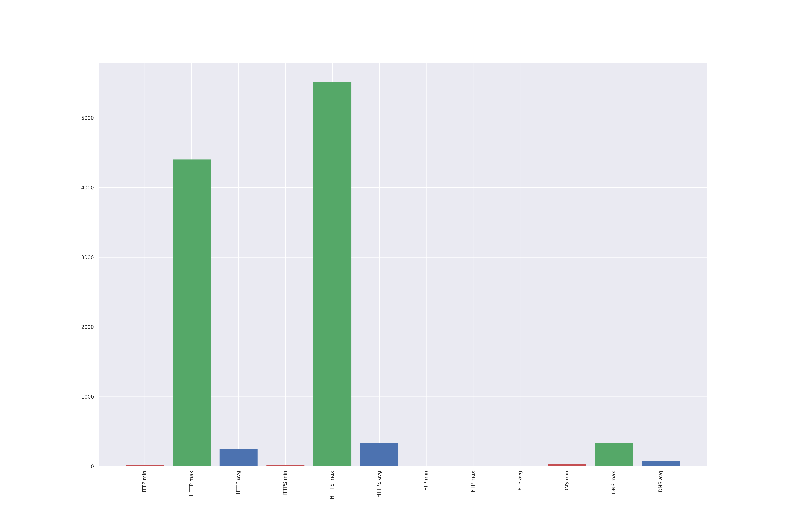
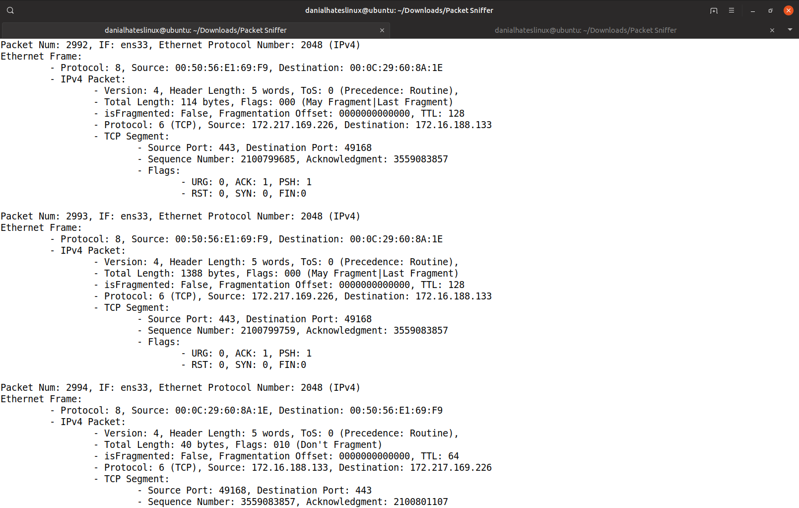

# Computer Networks Course Projects

This repository contains the code and documentation for three practical projects completed for the Computer Networks
course.

A complete description of each project can be found in the `docs/instructions.pdf` and `docs/report.pdf` files for each
respective project. (in Persian)

## Project 1: Chat Application

The first project is a command-line chat application built with Python and sockets. Key features:

- Client-server architecture with a multi-threaded server
- Support for 1-on-1 messaging and group chats
- Ability to share files between clients

## Project 2: Packet Sniffer

The second project is an IPv4 packet sniffer implemented in Python. When run, it prints out information about captured
packets in real-time. After execution, it also generates a text file with summary statistics:

- Total number of TCP, UDP, and ICMP packets
- List of sender IP addresses sorted by number of packets sent
- Number of packets sent
- Max, average, and min packet sizes

Additionally, the sniffer visualizes the above metrics using matplotlib plots. It can analyze protocols like DNS and
HTTP beyond IPv4. Figures below are example outputs of the programs.

|                       Transport Layer Protocols                       |                       Source IP Frequency                        |
|:---------------------------------------------------------------------:|:----------------------------------------------------------------:|
|  |  |
|                            App protos size                            |                           Sample logs                            |
|      |             |

## Project 3: Mininet Topology

The third project follows
a [Mininet tutorial](https://homepages.dcc.ufmg.br/~mmvieira/cc/OpenFlow%20Tutorial%20-%20OpenFlow%20Wiki.htm) to set up
a simple network topology with a switch and router. The topology is created programmatically and tested within the
Mininet environment.

Sections 1-7 of the tutorial were completed.

## Course Information

- **Course**: Computer Networks
- **University**: Amirkabir University of Technology
- **Semester**: Fall 2020

Let me know if you have any questions!
